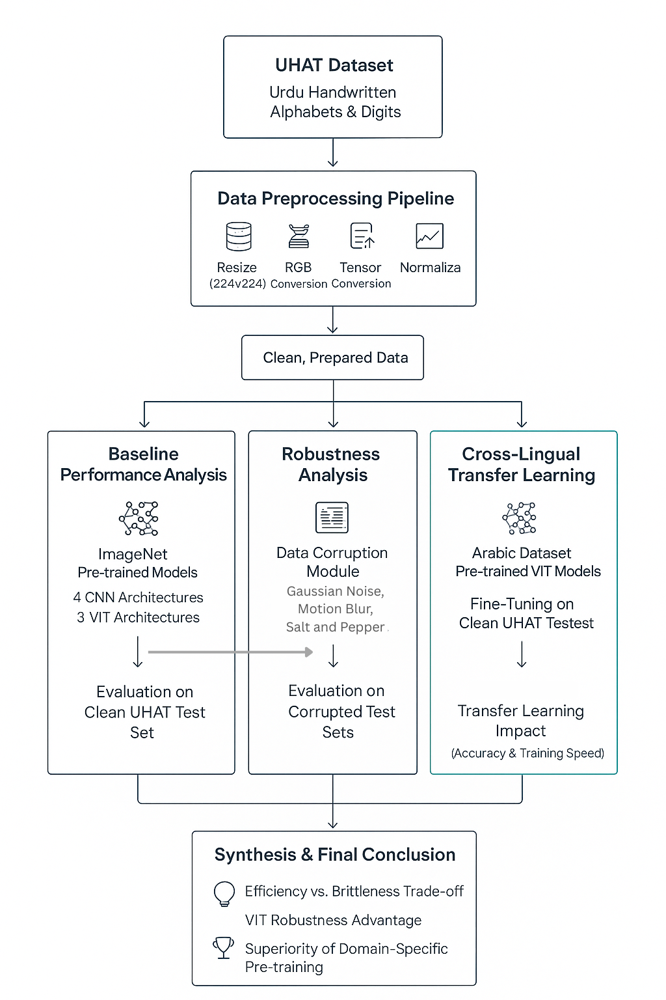

# Beyond Clean Accuracy: A Deep Dive into the Robustness and Transferability of Vision Transformers for Urdu Handwritten Character Recognition

**Author:** Zaryab Rahman

---

 
  
  
<em>Fig 1: The experimental framework comparing CNNs and ViTs across clean data, corrupted data, and cross-lingual transfer learning.</em>

---

## Abstract

Automated recognition of complex scripts like Urdu is crucial for digitizing cultural
heritage, yet the intricacy of its cursive style remains a significant barrier. Current benchmarks, however,
focus almost exclusively on accuracy with clean data, largely ignoring the performance degradation
models face under real-world conditions like noise and blurring. This creates a misleading picture of
their practical viability. This work challenges that paradigm by presenting the first systematic robustness
analysis of seven Convolutional Neural Network (CNN) and Vision Transformer (ViT) architectures for
Urdu Handwritten Character Recognition. We also investigate the untapped potential of cross-lingual
transfer learning from a visually similar Arabic script as an alternative to standard ImageNet pre-training.
Our findings reveal a critical trade-off: lightweight CNNs, while efficient on clean data, are exceptionally
brittle and fail under corruption. Conversely, Vision Transformers demonstrate remarkable resilience.
When pre-trained on Arabic, the Swin Transformer not only becomes robust but also achieves state-of-
the-art accuracy, surging from 92% to 99% which is a 7% absolute gain—while reducing training time
by 40%. We conclude that the optimal architecture is not absolute but is contingent on the expected
operational environment. This study provides a crucial, evidence-based guide for selecting models that
are not just accurate, but genuinely reliable for practical, real-world applications.

### 💡 Key Breakthroughs
1.  **The Fragility of Efficiency:** Lightweight CNNs (MobileNetV2, EfficientNet), while fast and accurate on clean data, **collapse** under noise.
2.  **The Power of Transformers:** Vision Transformers (ViTs) demonstrate superior resilience to structural corruption.
3.  **The Arabic Advantage:** Pre-training on **Arabic script** (instead of ImageNet) boosts the Swin Transformer to State-of-the-Art performance:
    *   **Accuracy:** 92% ➔ **99%**
    *   **Training Time:** Reduced by **40%**

---

## 📊 Experiment 1: The Baseline (Clean Data)

We first established a baseline on the uncorrupted UHAT dataset. CNNs initially dominate due to their inductive bias for local features (strokes and dots).

| Model | Type | Params (M) | GFLOPs | Accuracy | F1-Score | Inference (ms/img) |
| :--- | :---: | :---: | :---: | :---: | :---: | :---: |
| **ResNet-18** | CNN | 11.20 | 3.65 | **0.9882** | 0.9634 | 3.06 |
| **ResNet-50** | CNN | 23.59 | 8.27 | 0.9869 | **0.9924** | 3.54 |
| **MobileNetV2-100**| CNN | **2.28** | **0.60** | 0.9810 | 0.9569 | **2.86** |
| **EfficientNet-B0**| CNN | 4.06 | 0.77 | 0.9876 | 0.9629 | 2.90 |
| ViT-Tiny | ViT | 5.53 | 2.15 | 0.9606 | 0.9379 | 2.86 |
| Swin-Tiny | ViT | 27.55 | 8.74 | 0.9216 | 0.9000 | 4.65 |
| DeiT-Tiny | ViT | 5.54 | 2.16 | 0.9743 | 0.9503 | 3.05 |

  

  

---

## 🛡️ Experiment 2: Robustness Analysis (The Stress Test)

This is the core contribution of our work. We subjected all models to 6 types of corruption (Gaussian Noise, Motion Blur, etc.) at 5 severity levels.

**The Result:** The hierarchy shatters. The efficient CNNs are "Fragile Specialists," failing completely under high-frequency noise. ViTs, particularly **Swin** and **DeiT**, prove to be much more robust contenders.

### Normalized Robustness AUC (Higher is Better)

| Model | Gaussian Noise | JPEG | Motion Blur | Occlusion | Rotation | Salt & Pepper |
| :--- | :---: | :---: | :---: | :---: | :---: | :---: |
| ResNet18 | **0.978** | **0.988** | 0.283 | 0.546 | 0.673 | 0.641 |
| ResNet50 | 0.918 | 0.987 | 0.272 | 0.575 | **0.682** | 0.100 |
| MobileNetV2 | ❌ 0.070 | 0.974 | 0.256 | 0.606 | 0.643 | 0.359 |
| EfficientNet-B0 | ❌ 0.036 | 0.985 | 0.197 | **0.604** | 0.639 | 0.040 |
| ViT-Tiny | 0.956 | 0.961 | 0.417 | 0.554 | 0.484 | 0.810 |
| **Swin-Tiny** | 0.920 | 0.922 | **0.511** | 0.480 | 0.487 | 0.784 |
| **DeiT-Tiny** | 0.972 | 0.974 | 0.303 | 0.587 | 0.488 | **0.856** |

  <!-- 🔴 PLACEHOLDER: Insert 'Figure 11' (The Heatmap) here. This is visually very important. -->
  
  
<em>Fig 2: Heatmap of Normalized Robustness AUC. Note the dark purple cells for lightweight CNNs indicating collapse under noise.</em>

---

## 🌍 Experiment 3: Cross-Lingual Transfer Learning

Standard ImageNet pre-training is suboptimal for handwriting. We hypothesized that pre-training on **Arabic** (visually similar to Urdu) would be superior.

**The results were transformative.** The Swin Transformer, which struggled with ImageNet weights, became the best performing model.

| Model | Pre-training Source | Accuracy (%) | F1-Score | Train Time (s) |
| :--- | :--- | :---: | :---: | :---: |
| DeiT-Tiny | ImageNet | 97.00 | 0.95 | 2680 |
| **DeiT-Tiny** | **Arabic (Ours)** | **98.00** | **0.96** | **2680** |
| Swin-Tiny | ImageNet | 92.00 | 0.90 | 5587 |
| **Swin-Tiny** | **Arabic (Ours)** | **99.00** 🚀 | **0.96** | **3327** 📉 |

  
  
<em>Fig 3: Arabic pre-training (Orange) consistently outperforms ImageNet pre-training (Blue) in both Accuracy and Speed.</em>

---

## 🧠 Explainable AI (XAI) Visualizations

We utilized **Grad-CAM** to verify *why* Transformers are more robust.

### Case Study: Motion Blur
The **Swin Transformer** (Top) successfully reconstructs the character features despite the blur. **ResNet-18** (Bottom) fails, looking at the wrong features.

  

### Case Study: Salt & Pepper Noise
**DeiT** (Top) ignores the noise pixels and focuses on the stroke. **EfficientNet** (Bottom) gets confused by the noise and fails.

  

---

## 📝 Conclusion

1.  **Context Matters:** Do not choose architectures based on clean accuracy alone. If the deployment environment is noisy, lightweight CNNs are risky.
2.  **Reliability:** ResNet remains a safe baseline, but ViTs offer specialized robustness against structural corruption.
3.  **Optimal Strategy:** For Urdu HCR, the **Swin Transformer pre-trained on Arabic data** is the definitive winner, offering the best trade-off between accuracy, robustness, and training efficiency.

---
